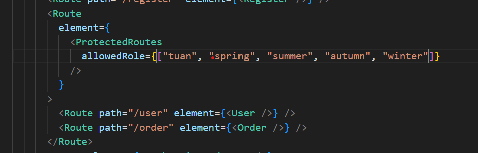
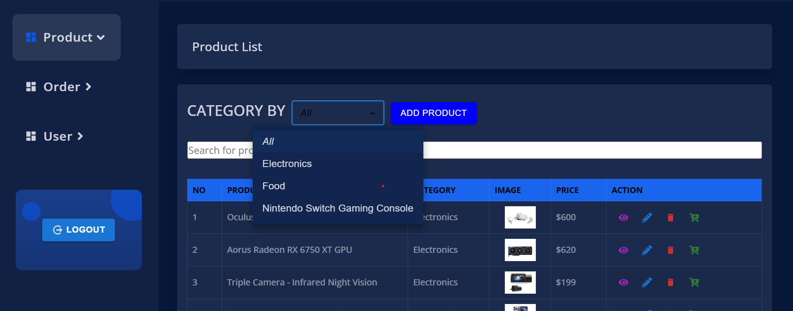
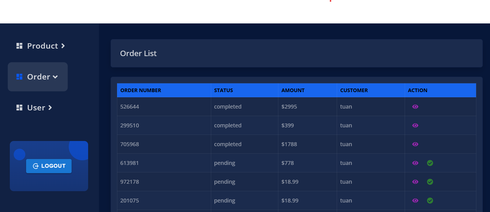
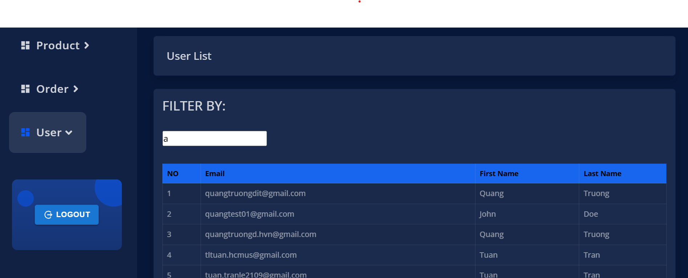
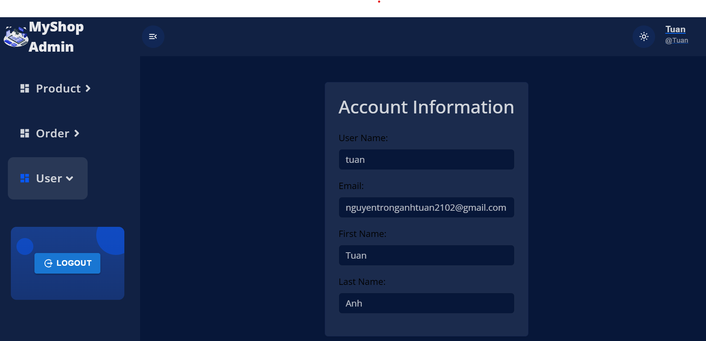

# How to set up and run MyShop Application

This project was bootstrapped with [Create React App](https://github.com/facebook/create-react-app).

## Access the application by using public hosted link

Open the link on your web browser:
### `https://at-reactjs-intensive-1b521d331384.herokuapp.com`

## Run the app locally

Clone the code from the Github's repository with:

### `git clone https://github.com/HnKnA/ReactJS-Intensive-Assignment.git`

Install necessary dependencies:

### `yarn install`

Or you can use `npm install` if your package manager is `npm`.

Launches the application:

### `yarn dev`

Or `npm run dev`.

Access `http://localhost:3000/` to open the app.

## Note:
### ProtectedRoute:
- User currently do not have `role` field, so `ProtectedRoute` will use username to separate each role. 

- Access as "fake admin" by log in with ***username:*** `tuan` and ***password:*** `Anhtuan@123456`.

- Or I've prepared some privileged username such as `spring`, `summer`, `autumn`, `winter`. You can create new account with these username to access the `/user` vs `/order` page.

### Search bar:
- Product's search bar is unavailable because of failing to access `/api/shop/product/search` endpoint.

- User list will be fetch by calling `/api/user/search` with `searchKey` "a" to return all available users because endpoint to GET all users is currently unavailable. After that, you can use the search bar on user's page normally.

### Add or Update image field:
- Only the CREATE product api is available at the moment, and it do not affect the product's list after successfully creating. So you can add an arbitrary string to replace to field in the form. 

- I will update this functionality as soon as the user's role is published.

### Order page:
- For the time being, every user is counted as "normal user" so each person can only access and complete their orders. But as we are implementing the "fake admin" privilege, only the username in this list can acccess the page and see their orders [`tuan`, `spring`, `summer`, `autumn`, `winter`].

- Username outside of the list can not access /order page normally.

## Services:
### Product page:

- Search bar is unavailable.
- Filter products based on their category (Javascript implemented).
- Create Order.
- Add, View, Edit, Delete (Product).

### Order page (fake admin privilege):

- Complete pending orders.
- View personal orders.
- Can not view all orders of all users because there is no admin at the moment.

### User page (fake admin privilege): 

- Search/Filter users

### Account page (click on your username on the header):

- Readonly form

### Register, Login, Verify.
### Light/Dark theme (sun icon on the header). 
### Log out.